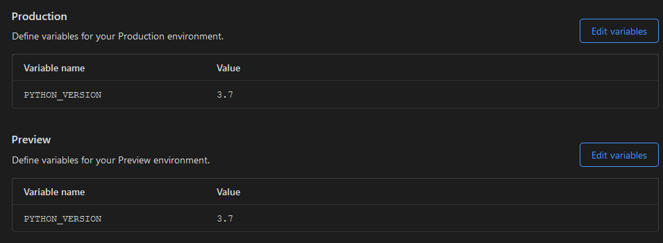

# Cloudflare Pages and Sphinx

Example repo to guild Sphinx with a pipfile on Cloudflare Pages.

Need to setup your enviorment variables to match

There seems to be an issue with how Piplock files are handles which is why you need to have the pipfiles be hidden so they aren't auto processed. The [build script](./build.sh) handles moving them back and installing everything.

Sphinx 5.3.0 is that latest version that can run on Workers.